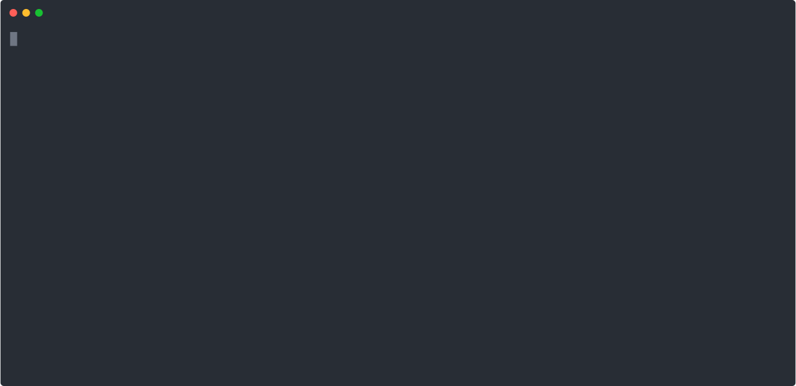

# colr [](https://github.com/k1LoW/colr/releases)

`colr` colors strings, colorfully.



## Usage

``` console
$ tail -F /var/log/nginx/access.log | colr POST GET 404 500 search
```

## Install

**homebrew tap:**

```console
$ brew install k1LoW/tap/colr
```

**manually:**

Download binany from [releases page](https://github.com/k1LoW/colr/releases)

**go get:**

```console
$ go get github.com/k1LoW/colr
```
